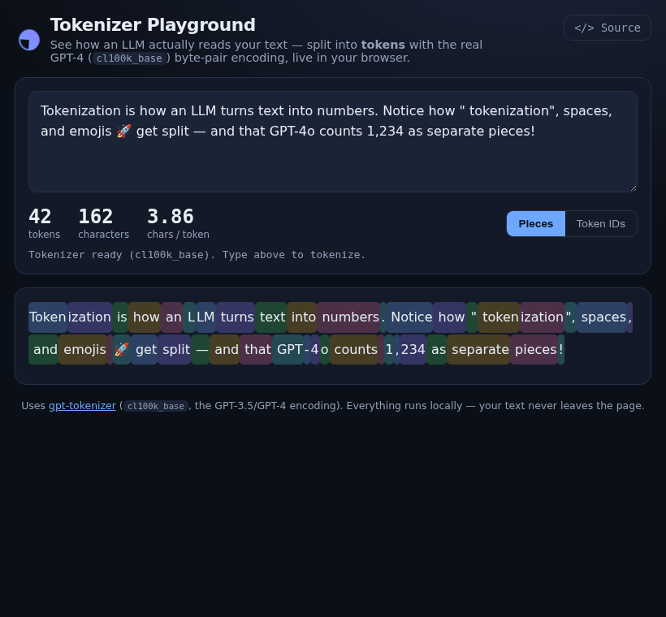

# Tokenizer Playground

See how a large language model actually reads your text — split into **tokens** using the real GPT-4 (`cl100k_base`) byte-pair encoding, live in your browser.

> **Live demo:** https://tongchen2010.github.io/assets/demos/tokenizer-playground.html



---

## What it shows

LLMs don't see characters or words — they see **tokens**. This playground tokenizes whatever you type and renders each token as a colored chip, so you can see exactly where the model splits things:

- a leading space is usually part of the next token (`" tokenization"`),
- common words are one token, rare ones get broken into pieces,
- numbers like `1,234` and emoji 🚀 split in surprising ways.

It also reports the token count, character count, and the chars-per-token ratio (handy for estimating context-window usage and API cost), and can switch between showing the **decoded pieces** and the raw **token IDs**.

## How it works

Tokenization runs entirely client-side via [`gpt-tokenizer`](https://github.com/niieani/gpt-tokenizer) (the `cl100k_base` encoding used by GPT-3.5/GPT-4), loaded from a CDN as an ES module. No backend, no API key — your text never leaves the page.

## Run locally

```bash
python3 -m http.server 8000
# open http://localhost:8000/
```

## License

MIT © Tong Chen
